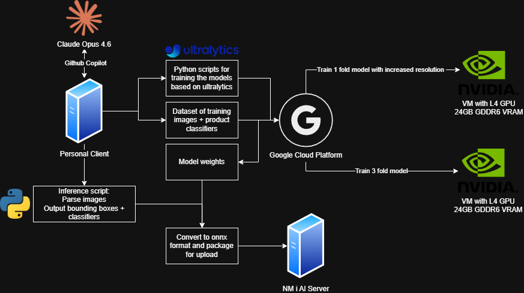
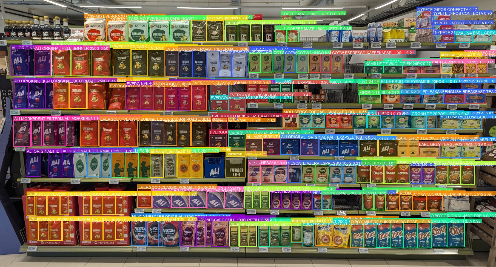
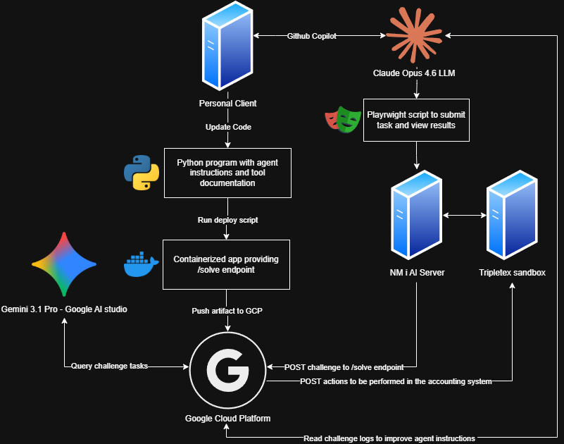
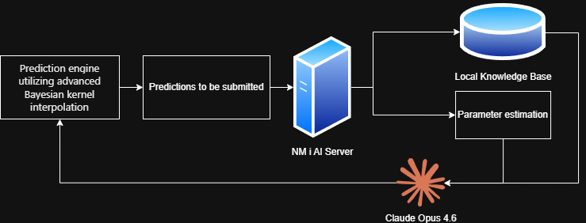
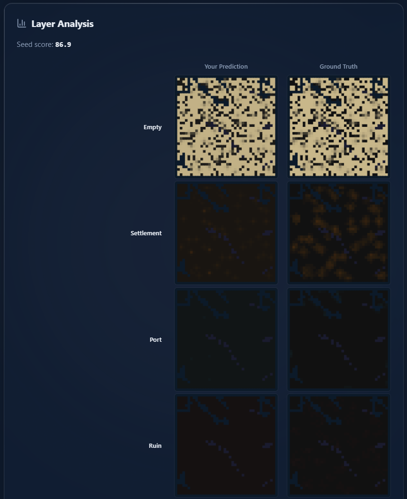

# Norwegian AI National Championships 2026

**Platform:** [app.ainm.no](https://app.ainm.no) &nbsp;|&nbsp; **Duration:** 4 days (March 2026)

---

## Overview

Four days of live-scored AI engineering across computer vision, autonomous agents, and probabilistic simulation modelling.

**Peak placement: 13th (Day 2).** Spent most of the competition around 30th before finishing at **XX**.

Things that actually moved the needle:

- Each scoring function had non-linear properties (mAP@0.5, KL divergence, API correctness). Reading the curve early was worth more than clean code.
- The AstarIsland knowledge base grew from 1 to 13 rounds of ground-truth over the competition. Each new round improved predictions more than any algorithmic change.
- Wiring Gemini 2.5 Pro to a live REST API with multi-turn self-correction required real tool schema design, not just a system prompt.
- The biggest single score jump (+0.248) in object detection came from *removing* a classifier that was overwriting YOLO's already-correct predictions.
- Two of three tasks needed working production deployments (GCP Cloud Run, Docker sandbox). Getting the model right was only half the problem.
- In the stochastic sim, estimating the hidden survival rate via MLE over ~10,000 cells instead of ~50 settlements cut estimation error by 4-10x.

---

## Task 1 — NorgesGruppen Grocery Object Detection

> Detect and classify grocery products on Norwegian store shelf images. Scored as `0.7 × detection mAP@0.5 + 0.3 × classification mAP@0.5` across 356 product categories.

### Architecture



### Example Detections



Local hardware wasn't going to cut it, so I applied for GCP access through the competition and got it. I ran two Linux VMs in parallel (g2-standard-16, NVIDIA L4 GPU, 24 GB VRAM each): one training a 3-fold ensemble at 1280px, the other fine-tuning a single model at higher resolution (1536px, then 1792px). The higher-res single model won out and became the final submission.

The pipeline is a single **YOLOv8x** (68M params, trained at 1536px on all 248 shelf images, 22,731 annotations). YOLO's class head outputs category IDs 0-355 directly, so there's no separate classifier. At inference, 6 TTA passes (3 scales × 2 flips) are merged with Weighted Boxes Fusion. Best submitted score: **0.9095** (leader was 0.9255, so 98.3% of the top).

**Stack:** Python 3.12 · YOLOv8x (Ultralytics) · ONNX · WBF · GCP g2-standard-16 · Docker

### Plateaus and fixes

| Plateau | Fix |
|---|---|
| EfficientNet classifier overwriting YOLO's correct class predictions (score 0.599) | Removed it entirely. YOLO class IDs are the category IDs. Score jumped to 0.847. |
| YOLOv8m at 640px capped mAP50 around 0.47 on local hardware | Moved to GCP, YOLOv8x at 1536px, 300 epochs, mAP50 0.9748 |
| NMS discarding valid TTA detections across multi-scale passes | Replaced with Weighted Boxes Fusion |

---

## Task 2 — Tripletex Accounting Agent

> Build an autonomous AI agent that receives natural-language accounting task prompts in any of 7 languages (Norwegian, Nynorsk, English, German, French, Spanish, Portuguese), interprets them, and executes the correct sequence of operations against the live [Tripletex](https://www.tripletex.no/) accounting API. Covers 30 task types: creating employees, posting journal entries, reconciling bank transactions, managing invoices, registering travel expenses, and more.

### Architecture



FastAPI service on GCP Cloud Run with a single `POST /solve` endpoint. Each submission gets a fresh Tripletex sandbox. Gemini 2.5 Pro runs a function-calling loop: decide which API calls to make, execute them, then recover from errors by feeding the raw response back into context. Scored field-by-field with an efficiency bonus.

**Stack:** Python 3.12 · FastAPI · Gemini 2.5 Pro · httpx · GCP Cloud Run · Docker

### Plateaus and fixes

| Plateau | Fix |
|---|---|
| Prompts in 7 different languages confused single-shot parsing | Let Gemini 2.5 Pro handle intent parsing end-to-end with a multilingual system prompt |
| Hard-coded field names caused schema mismatches against the live API | Verified every field against the Tripletex OpenAPI spec, embedded constraints in function declarations |
| PUT requests failing silently due to missing `version` field | GET-before-PUT pattern, raw 4xx error bodies fed back to the model |

---

## Task 3 — Astar Island (Stochastic Civilisation Predictor)

> A 40x40 Norse settlement simulator runs 50-year stochastic simulations. Given 50 viewport queries per round, predict the full final-state probability distribution across 6 terrain classes for every cell. Leaderboard score is `round_score x round_weight`, weights compound ~5% per round.

### Architecture



### Example



Two hidden parameters change every round: the **settlement survival rate** (2% to 60% across rounds) and the **expansion rate** (how likely plains cells are to become new settlements). Nail those estimates and the predictions fall into place. The model went through four versions; each completed round added ground-truth to a knowledge base that made the next round better automatically.

Score progression: V1 heuristic 27.3 raw / V2 GT-calibrated 80.1 raw / V3 MLE + survival KB 86.6 raw (141.1 weighted) / V4 Gaussian kernel + expansion KB + Bayesian blending **89.0 raw (185.9 weighted)**

Final rank: **#56 / 347 teams.** Gap to #1 was ~10.7 weighted points after Round 15.

V4 in short: run MLE over ~10,000 observed cells to estimate survival rate, count plains transitions for expansion rate, look up the cell's context key in a 2D KB indexed by both, smooth with Gaussian kernel regression across all 15 historical rounds, then Bayesian-update with any direct observations (Dirichlet-Multinomial, adaptive concentration). A 3x3 grid tiling strategy covers 100% of the 40x40 map so no cell goes unobserved.

**Stack:** Python 3.12 · NumPy · JWT auth · Custom MLE optimiser · 2D JSON knowledge base (survival x expansion)

### Plateaus and fixes

| Plateau | Fix |
|---|---|
| V1/V2 static priors broke when survival rate shifted between rounds | Survival-indexed KB built from ground-truth of completed rounds; interpolate at prediction time |
| Counting ~50 surviving settlements gave noisy survival estimates | MLE over all ~10,000 observed cells. Plains, forest, ports, ruins all carry signal. Error down 4-10x. |
| Near-settlement plains cells were 39% of total prediction error despite good survival estimates | Found a second hidden parameter (expansion rate), built a 2D KB, replaced linear interpolation with Gaussian kernel smoothing |

---

## Repository Structure

```
NMiAI/
├── ObjectDetection/     # Task 1 — YOLOv8x grocery detection (score 0.9095, 98.3% of leader)
├── AccountingAgent/     # Task 2 — Tripletex AI agent (FastAPI + Gemini 2.5 Pro, GCP Cloud Run)
├── AstarIsland/         # Task 3 — Norse civilisation predictor (MLE + survival-indexed KB)
└── Static/              # Architecture diagrams and example images
```

---

## Results Summary

| Task | Result |
|---|---|
| Object Detection | Score **0.9095** (98.3% of the leaderboard leader at 0.9255) |
| Tripletex Agent | Functional end-to-end; scored on task completion rate |
| Astar Island | **185.9 weighted** (89.0 raw) — V4, Round 15 — rank #56 / 347 |

**Peak leaderboard position: 13th (Day 2) · Final placement: XX**

---

*Built solo over 4 days. All models trained, deployed, and iterated on during the live competition window.*
